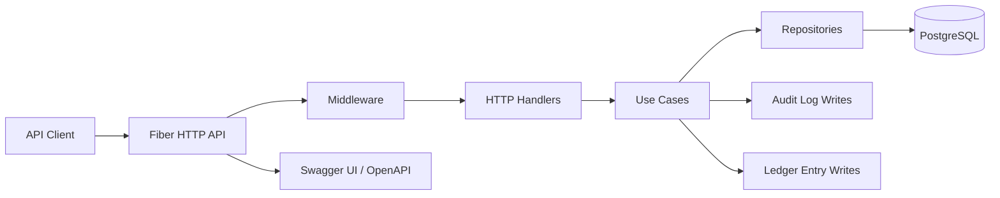
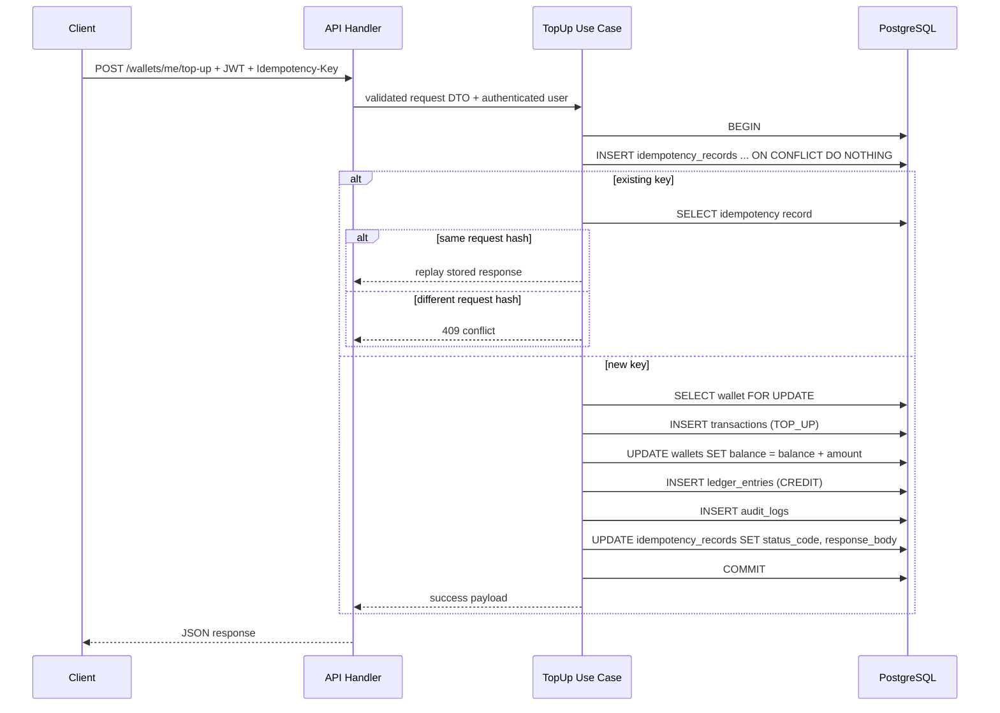
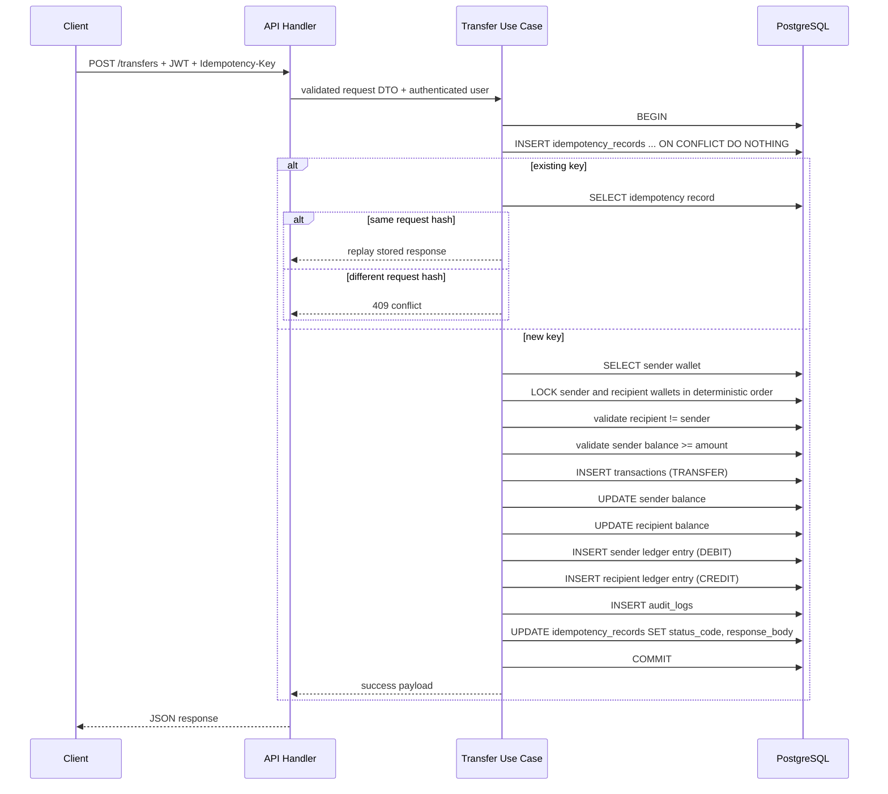

# Architecture

`go-hermes` is designed as a small but production-minded wallet platform. The codebase favors clear boundaries, explicit transaction handling, and operationally realistic tradeoffs over framework-heavy abstraction.

## System Overview

At a high level, the request path is:

1. Fiber receives the HTTP request.
2. Middleware attaches request ID, performs recovery, logs the request, and validates JWT when needed.
3. Handlers map HTTP payloads into DTOs and pass validated input into use cases.
4. Use cases orchestrate business rules, idempotency, locking, transaction management, audit logging, and persistence.
5. Repositories isolate GORM and PostgreSQL details from the business layer.
6. The response is returned in a consistent API envelope.

## Application Layers

- `cmd/api`
  Boots the process, loads config, initializes dependencies, and registers routes.
- `internal/config`
  Reads environment-based configuration for app, DB, JWT, docs, and seed behavior.
- `internal/delivery/http`
  Contains handlers, DTOs, route definitions, and HTTP response writing.
- `internal/middleware`
  Holds auth middleware, role enforcement, and request lifecycle logging.
- `internal/usecase`
  Contains business rules such as register, login, top up, transfer, history queries, and admin reads.
- `internal/repository`
  Implements GORM repositories and the DB transaction manager.
- `internal/entity`
  Defines core entities and enum-like types shared across layers.
- `internal/pkg`
  Cross-cutting helpers such as JWT, hashing, validation, pagination, and idempotency hashing.

## Runtime Components



## ERD

The schema is intentionally compact. `users` and `wallets` are 1:1, while `transactions`, `ledger_entries`, `idempotency_records`, and `audit_logs` provide traceability around money movement and privileged reads.

```mermaid
erDiagram
    USERS ||--|| WALLETS : owns
    USERS ||--o{ TRANSACTIONS : initiates
    USERS ||--o{ IDEMPOTENCY_RECORDS : submits
    USERS ||--o{ AUDIT_LOGS : acts
    WALLETS ||--o{ TRANSACTIONS : source_wallet
    WALLETS ||--o{ TRANSACTIONS : destination_wallet
    TRANSACTIONS ||--o{ LEDGER_ENTRIES : generates
    WALLETS ||--o{ LEDGER_ENTRIES : affects

    USERS {
        uuid id PK
        string name
        string email UK
        string password_hash
        string role
        timestamptz created_at
        timestamptz updated_at
    }

    WALLETS {
        uuid id PK
        uuid user_id FK_UK
        bigint balance
        string status
        timestamptz created_at
        timestamptz updated_at
    }

    TRANSACTIONS {
        uuid id PK
        string transaction_ref UK
        string type
        string status
        uuid source_wallet_id FK
        uuid destination_wallet_id FK
        bigint amount
        string currency
        string idempotency_key
        uuid initiated_by_user_id FK
        string description
        timestamptz created_at
        timestamptz updated_at
    }

    LEDGER_ENTRIES {
        uuid id PK
        uuid transaction_id FK
        uuid wallet_id FK
        string entry_type
        bigint amount
        bigint balance_before
        bigint balance_after
        timestamptz created_at
    }

    IDEMPOTENCY_RECORDS {
        uuid id PK
        string idempotency_key
        uuid user_id FK
        string request_hash
        string endpoint
        int status_code
        jsonb response_body
        timestamptz created_at
        timestamptz updated_at
    }

    AUDIT_LOGS {
        uuid id PK
        uuid actor_user_id FK
        string action
        string entity_type
        uuid entity_id
        jsonb metadata
        timestamptz created_at
    }
```

## Sequence Flow: Top Up



## Sequence Flow: Transfer



## Idempotency Design Decision

The service uses `Idempotency-Key` for top up and transfer because these are money movement endpoints where duplicate execution is unacceptable.

### Why the key is scoped by `(idempotency_key, user_id, endpoint)`

- The same raw key can safely be reused by different users.
- Top up and transfer should not collide with each other even if a client accidentally reuses the same key string.
- The DB-level unique constraint gives a hard safety boundary that does not rely only on application code.

### Why request payload hashing is stored

- A repeated request with the same key and same payload should replay the original response.
- A repeated request with the same key and different payload is a client correctness problem and should fail with `409 Conflict`.
- Storing only the key is not sufficient because it cannot distinguish a safe retry from a semantic mismatch.

### Why the original response body is persisted

- Retries receive the same response shape and status code as the initial successful request.
- Clients can safely retry on timeout without risking duplicate money movement.
- Persisted replay data keeps the handler logic simple and deterministic.

### Why idempotency is applied only to top up and transfer

- Register and login are important, but they are not balance-mutating operations in the same risk class.
- The strongest operational need is on side-effect-heavy endpoints with financial impact.
- The pattern can be extended later if the API grows into payout, withdrawal, or bill payment flows.

## Locking Design Decision

Wallet balance updates happen inside a single DB transaction with row-level locks.

### Why row locking is necessary

- Two concurrent transfers from the same wallet can both read the same starting balance if no lock is taken.
- That creates lost updates or overdraft behavior depending on implementation details.
- `SELECT ... FOR UPDATE` gives a clean concurrency control point at the wallet row level.

### Why deterministic lock ordering is used

- Transfers lock two wallet rows.
- If transaction A locks wallet X then waits for Y, while transaction B locks Y then waits for X, the system can deadlock.
- Sorting wallet IDs before locking reduces deadlock probability by ensuring all transactions request locks in the same order.

### Why top up also locks the wallet row

- Top up is a balance mutation too.
- Consistent locking semantics across all balance-changing operations reduce surprise and simplify reasoning.

## Ledger Design Decision

The ledger is append-only and modeled separately from wallet balances.

### Why balances and ledger both exist

- `wallets.balance` is the current serving state for fast reads.
- `ledger_entries` is the immutable audit trail for how the balance changed over time.
- This combination is common in fintech systems because it balances performance with traceability.

### Why ledger entries are immutable

- Financial history should be corrected through new compensating entries, not silent mutation.
- Immutable rows preserve forensic value for support, reconciliation, and incident review.
- Even in a simplified service, this is an important signal of sound financial data modeling.

### Why transfer creates two ledger entries

- A transfer has two balance effects: debit on sender, credit on recipient.
- Recording both sides makes the movement explicit and queryable by wallet and by transaction.
- This is closer to double-entry-inspired thinking than trying to encode the entire movement as a single ambiguous row.

## Example cURL Requests

Register:

```bash
curl -X POST http://localhost:8080/api/v1/auth/register \
  -H 'Content-Type: application/json' \
  -d '{
    "name": "Alice",
    "email": "alice@example.com",
    "password": "Password123"
  }'
```

Login:

```bash
curl -X POST http://localhost:8080/api/v1/auth/login \
  -H 'Content-Type: application/json' \
  -d '{
    "email": "alice@example.com",
    "password": "Password123"
  }'
```

Get current wallet:

```bash
curl http://localhost:8080/api/v1/wallets/me \
  -H 'Authorization: Bearer <TOKEN>'
```

Top up:

```bash
curl -X POST http://localhost:8080/api/v1/wallets/me/top-up \
  -H 'Authorization: Bearer <TOKEN>' \
  -H 'Idempotency-Key: wallet-topup-001' \
  -H 'Content-Type: application/json' \
  -d '{
    "amount": 50000,
    "description": "Initial funding"
  }'
```

Transfer:

```bash
curl -X POST http://localhost:8080/api/v1/transfers \
  -H 'Authorization: Bearer <TOKEN>' \
  -H 'Idempotency-Key: wallet-transfer-001' \
  -H 'Content-Type: application/json' \
  -d '{
    "recipient_wallet_id": "<RECIPIENT_WALLET_ID>",
    "amount": 10000,
    "description": "Peer transfer"
  }'
```

List my transactions:

```bash
curl 'http://localhost:8080/api/v1/transactions/me?page=1&limit=10' \
  -H 'Authorization: Bearer <TOKEN>'
```

Admin audit logs:

```bash
curl 'http://localhost:8080/api/v1/admin/audit-logs?page=1&limit=20' \
  -H 'Authorization: Bearer <ADMIN_TOKEN>'
```

## Notes For Reviewers

- The code intentionally keeps business logic in use cases rather than hiding it in handlers or GORM hooks.
- Idempotency, locking, and audit writes are visible in the main money movement flows because those concerns are central to the domain.
- The implementation is deliberately small enough to run locally, but the documentation frames how the design would evolve in a more regulated environment.
